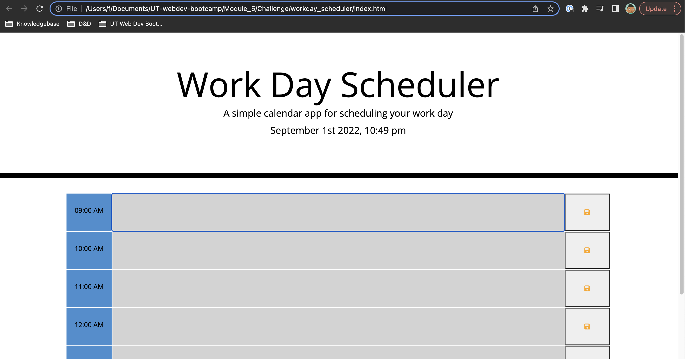

# Third Party API Calendar

## Workday-Calendar

Goal: Create a calendar application featuring dynamic HTML and Javascript powered by jQuery

Actions:

1. When user opens application a calendar shows with the date and time utilizing moment.js
2. The user is able view timeblocks for standard business hours
3. The timeblocks are color coded to represent: past, present, future
4. Upon clicking into a timeblock as a user I am able to enter an event and save
5. The events are saved in local storage
6. When the page is refreshed the save information still renders

## Demo

https://fightingwards.github.io/workday_scheduler/

## Credits

UT Web Development Boot Camp

## License

MIT License

Copyright (c) [2022] [fightingwards]

Permission is hereby granted, free of charge, to any person obtaining a copy
of this software and associated documentation files (the "Software"), to deal
in the Software without restriction, including without limitation the rights
to use, copy, modify, merge, publish, distribute, sublicense, and/or sell
copies of the Software, and to permit persons to whom the Software is
furnished to do so, subject to the following conditions:

The above copyright notice and this permission notice shall be included in all
copies or substantial portions of the Software.

THE SOFTWARE IS PROVIDED "AS IS", WITHOUT WARRANTY OF ANY KIND, EXPRESS OR
IMPLIED, INCLUDING BUT NOT LIMITED TO THE WARRANTIES OF MERCHANTABILITY,
FITNESS FOR A PARTICULAR PURPOSE AND NONINFRINGEMENT. IN NO EVENT SHALL THE
AUTHORS OR COPYRIGHT HOLDERS BE LIABLE FOR ANY CLAIM, DAMAGES OR OTHER
LIABILITY, WHETHER IN AN ACTION OF CONTRACT, TORT OR OTHERWISE, ARISING FROM,
OUT OF OR IN CONNECTION WITH THE SOFTWARE OR THE USE OR OTHER DEALINGS IN THE
SOFTWARE.
